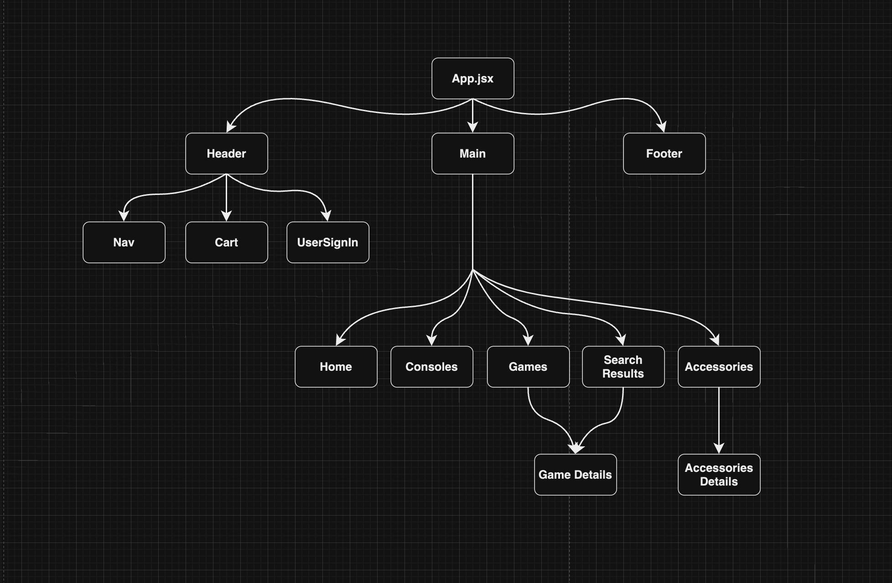
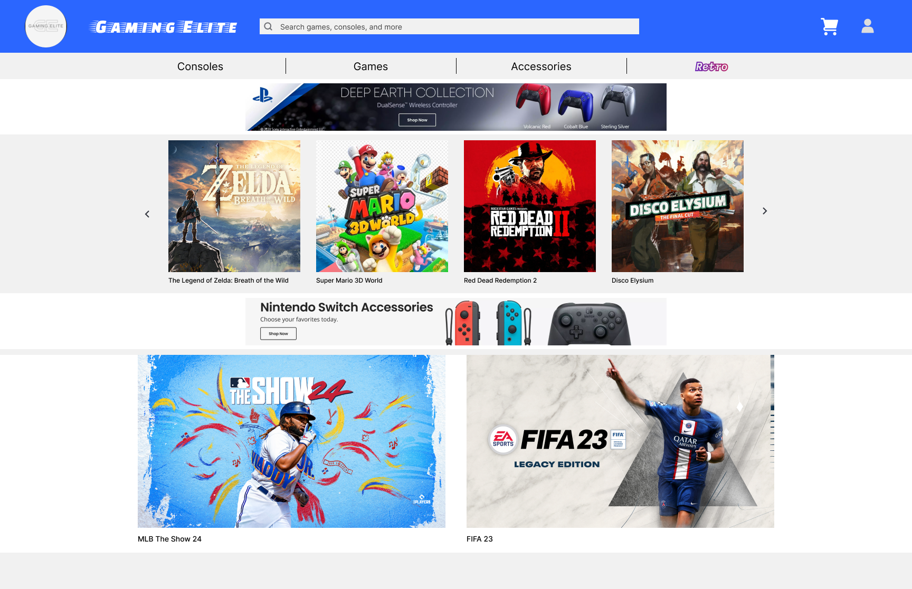
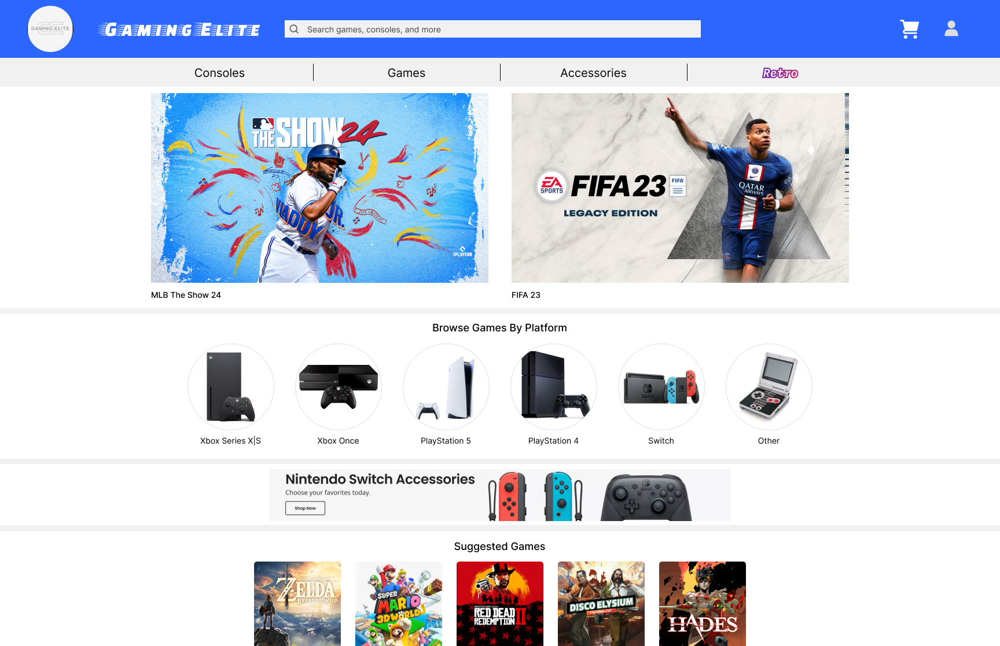
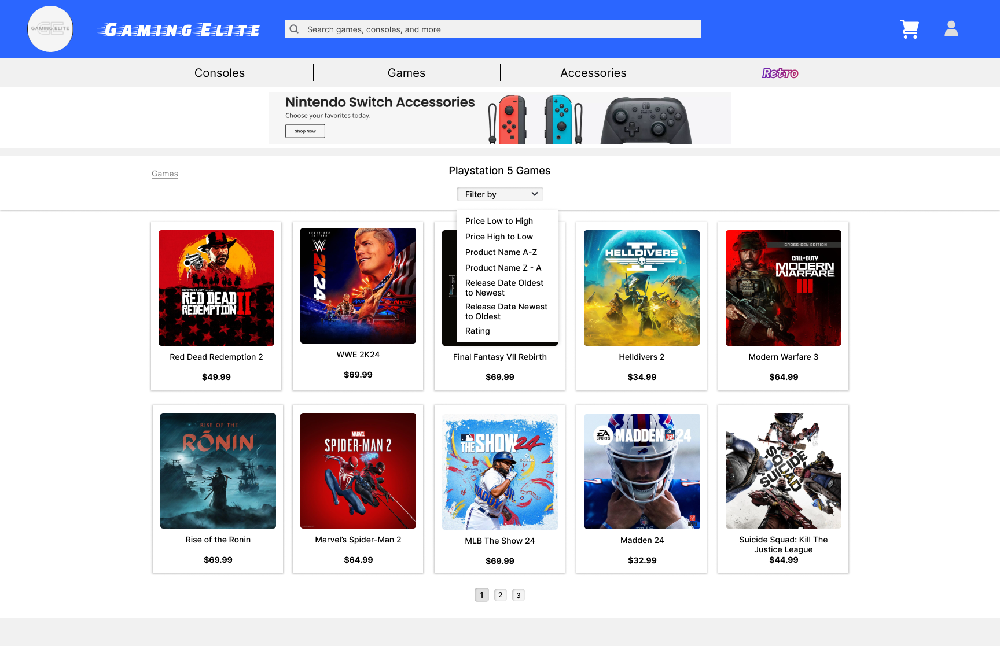
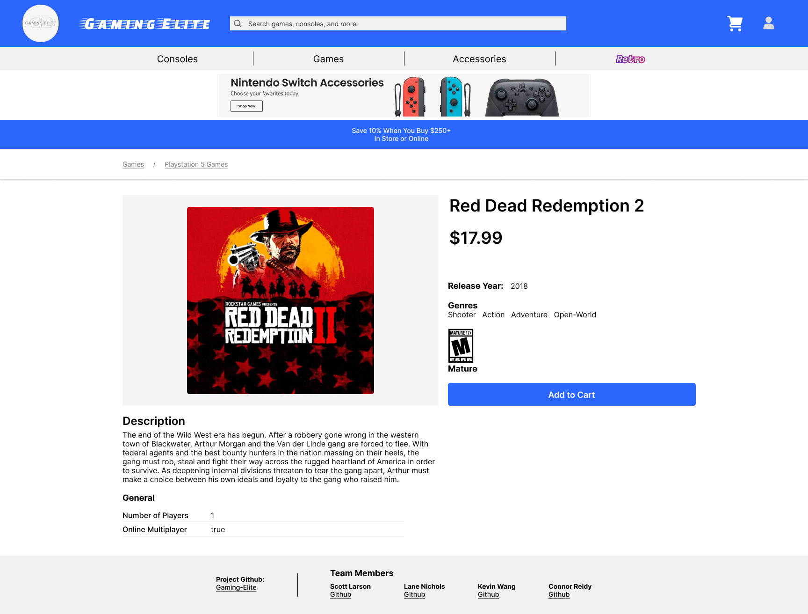
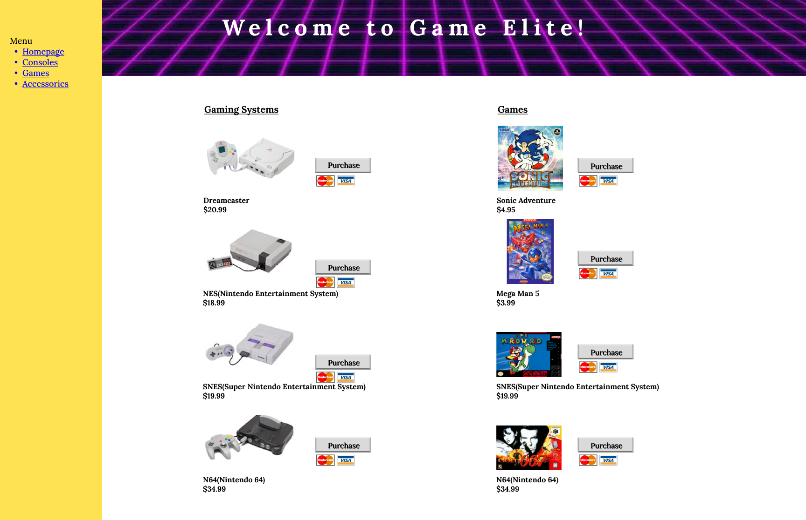

# Gaming-Elite
An e-commerce site for all your gaming needs, whether they're modern or retro. Browse different pages of video game consoles and titles. Sign in and add any product to your shopping cart.

## Teammates
- Scott Larsen [github](https://github.com/larsonscott89)
- Lane Nichols [github](https://github.com/Lane17027)
- Kevin Wang [github](https://github.com/kevinwang2882)
- Connor Reidy [github](https://github.com/connorreidy1)
## Trello - Project Manager
[Trello](https://trello.com/b/fJ1fUONn/project-3-games-elite)
Created a "To-Do" list, a "Working on" list, and daily "Done" lists to track what we needed to accomplish and what we had completed. We attached a member of the team to each task to keep a record of what everyone had finished.

## Technologies
- MongoDB
- Mongoose
- Express
- React
- Node.js
- Cors
- Morgan
- Body-parser
- Javascript, HTML, CSS
- React Icons

  
## MVP
- **MERN and CRUD**: Create a full-stack MERN application with full CRUD capability.
- **Models**: Create Models for data including: Brand, Console, Game, Accesory, User, and Cart.
- **Navigation**: The user can browse products by navigating between pages using navbars, menus, sidebars, and icons.
- **Search**: The user can search for a product and the page will populate with relevant products.
- **User Sign Up**: The user can register an account by providing an username and password. 
- **Signin/Logout**: The user can sign in and out and the shopping carts will retain products that were added by a user.
- **Add to Cart**: Products include an "Add to Cart" button and clicking it adds the product to the shopping cart.
- **Confirmation**: The user receives a confirmation message when a product has been successfully added to the cart.
- **View Cart**: The user can navigate to the shopping cart page and view the items that have been added. It will display the items indiviual values and the total cart value. The user can adjust quantities, remove items, or "proceed to checkout".
- **Flexbox**: Utilize Flexbox to a create dynamic app that works across all screens.
- **Ads**: Fake banner ads will be displayed on the webpages to give the app an authentic look.

## Stretch
- Create Models and Navigation for more products.
- Create more avenues of filtering to find products.

## ERD

## Component Hierarchy

## Wireframe
### Lofi

### Hifi

